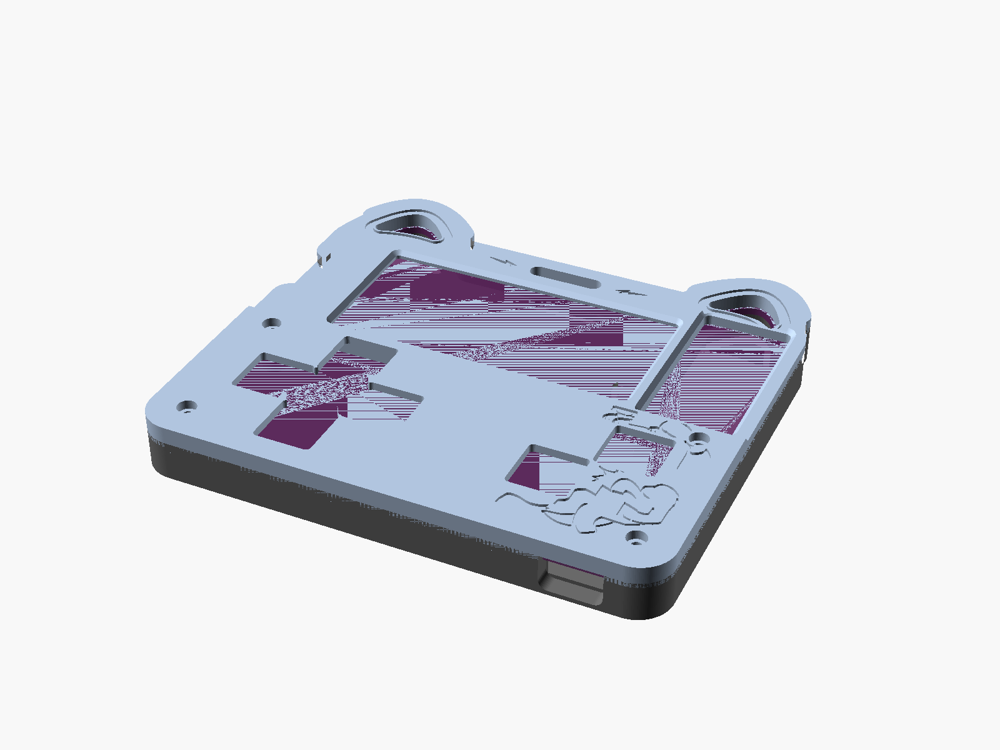
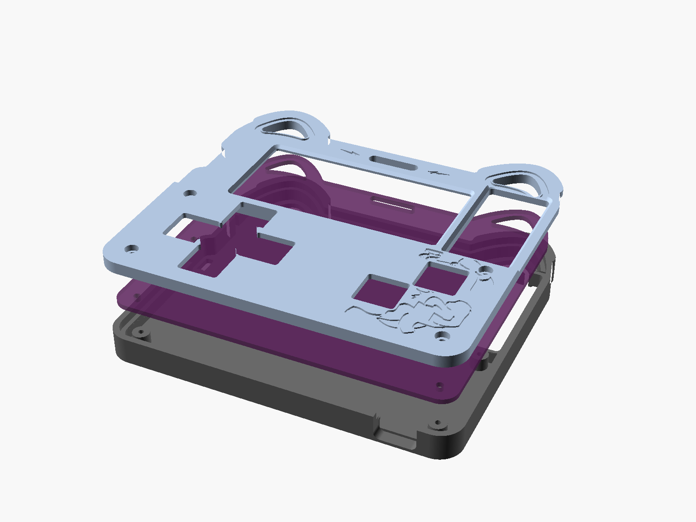

# 3D-printable case for the Outpost badge

A two-part, screw-together case generated straight from the KiCad board file.



| Back exterior (as seen from behind, rotated 180°) | Exploded |
| --- | --- |
|  |  |

## What it does

* **Removable protoboard cover** with openings for the six 12 mm buttons. The
  switch bodies pass through the cover and the Ø7 mm actuators stand ~3.7 mm
  proud of it. The four D-pad switches sit corner-to-corner, so the island
  between them cannot be printed; the D-pad is one plus-shaped opening with an
  open centre (`dpad_center_open`). A/B are a single joined opening.
* **NFC stays uncovered** on both sides: the front has a window over the whole
  antenna loop (and the flame art inside it), the back has a window over the
  same area, which is where the *OUTPOST* / `hack.club/outpost` QR / *July 14–20
  San Francisco* / Open Sauce block lives. The floor is raised around that
  window so the text sits 0.5 mm behind the print instead of at the bottom of a
  deep pocket.
* **Screen bezel**: a rail all round the e-ink (3.7 mm wide on the NFC side),
  1.8 mm above the glass with a 45° chamfer, 0.8 mm clear of the active area. The bezel sits on the
  PCB outside the module footprint and floats 1.4 mm above the glass; the FPC
  fold on the left edge has its own relief.
* **Back covered and protected**: 4.3 mm cavity under the PCB (USB-C receptacle
  is 3.3 mm, switch pins 3.5 mm), 1.2 mm ledge under the PCB edge, M2 bosses
  under the four mounting holes. Pen-tip holes with `RESET` / `BOOT` labels,
  a light hole for the status LED, a slot over the SWD pads, and a USB-C opening
  sized for the plug overmould (the receptacle face is flush with the PCB edge,
  so the plug has to reach through the wall).
* **Cat ears**: the case follows the PCB ears and grows them by 1.5 mm
  (`ear_boost`), and both faces get a recessed "inner ear" ring around each ear
  slot. All three lanyard cut-outs (two ears + centre slot) go through the
  front, the PCB and the back, so any clip or strap that fits the PCB fits the
  case.
* **Covered artwork is recreated** on the print. Every silkscreen and
  solder-mask polygon that ends up under plastic is engraved 0.6 mm into the
  outer face: on the back that is the red panda and flames, the RESET/BOOT
  swirls, the small cat by the USB port and the *HACK CLUB* flag; on the front
  it is the mascot and *HACK CLUB* flag on the protoboard area and the lightning
  bolts next to the centre slot. Features under 2 mm (the GPIO pin labels and
  the PCB's own 1.3 mm RESET/BOOT letters) are dropped because they will not
  print; RESET/BOOT are re-typed at 2.6 mm instead.

## Files

| File | What |
| --- | --- |
| `outpost_badge_case.scad` | The parametric model (OpenSCAD). Open it, use the customizer. |
| `board_data.scad` | Generated board geometry + artwork polygons. Do not edit; regenerate. |
| `tools/extract_board.py` | Reads `PCB/einkbadge.kicad_pcb` and writes `board_data.scad`. |
| `tools/export.sh` | Regenerates the data, all STLs and the preview images. |
| `stl/back.stl` | Back shell, print orientation. |
| `stl/front.stl` | One-piece front (bezel + ear frame + protoboard cover), print orientation. |
| `stl/front_header_slots.stl` | Same, with slots for pin headers soldered into J3–J6. |
| `stl/split_*.stl` | Alternative three-part version, see below. |

## Printing

Both parts print **face down, no supports**: the back shell exterior on the
bed with the cavity up, the front piece with its visible face on the bed. The
STLs are already in that orientation.

* 0.2 mm layers, 0.4 mm nozzle, 3 perimeters, PLA or PETG.
* The artwork is a 0.6 mm recess in the first three layers. For a two-colour
  result add a **filament change at 0.6 mm**: the first colour becomes the face,
  the second shows through as the art, the inner-ear rings and the labels.
* Footprint is about 113 × 105 mm per part. `part = "plate"` puts both on one
  bed (needs ~235 × 110 mm).

## Hardware

* 4 × **M2 × 8 mm** screws (self-tapping or machine screws into the 1.7 mm
  bosses). For heat-set inserts set `screw_hole_d = 3.2`.
* No other hardware. Total stack is 12.5 mm thick.

## Assembly

1. Stick the e-ink module to the PCB as usual and plug in the FPC.
2. Drop the PCB into the back shell, USB-C into its opening. It rests on the
   perimeter ledge and the four bosses.
3. Set the front on top; its rim sits on the wall and the inner plug drops
   inside it. Four M2 screws through the front's counterbores and the PCB's
   mounting holes into the bosses.
4. To get at the protoboard, undo the four screws and lift the front off. The
   PCB stays in the back shell.

## Split front (optional)

`split_front = true` (files `stl/split_*.stl`) makes the screen bezel and the
protoboard cover separate parts, so the cover can come off while the bezel
stays. The bezel sits inside a taller wall and has a tongue under the cover's
top edge, so the four screws clamp it; there is nothing else holding its top
end down, so add a dab of glue at the ears if it rattles. Use `split_back.stl`
with it (the wall is different).

## Assumptions worth checking on a real print

* Screen module thickness 1.4 mm including tape (`screen_h`). If the glass
  touches the bezel underside, raise it.
* Switches are the Würth WS-TATV 430476085716 from the footprint: 12 mm body,
  3.5 mm tall, 8.5 mm overall, 3.5 mm pins. Button openings are 12.8 mm.
* Pin headers J3–J6 are not populated by default; use `front_header_slots.stl`
  if you solder them in.
* PCB clearance 0.3 mm to the wall, 0.15 mm between front plug and wall. Tune
  `clearance` for your printer.

## Regenerating

```sh
pip install shapely            # optional, simplifies the artwork polygons
OPENSCAD=/path/to/openscad-2024+ case/tools/export.sh
```

OpenSCAD 2024 or newer is strongly recommended: with the Manifold backend each
part renders in a couple of seconds. OpenSCAD 2021.01 renders the same files but
takes many minutes because of the artwork polygons.

All coordinates in the model are millimetres with the origin at the centre of
the PCB, +Y towards the ears and Z = 0 at the PCB top surface, so any position
you read in KiCad is `(x - 204.418, 113.640 - y)`.
